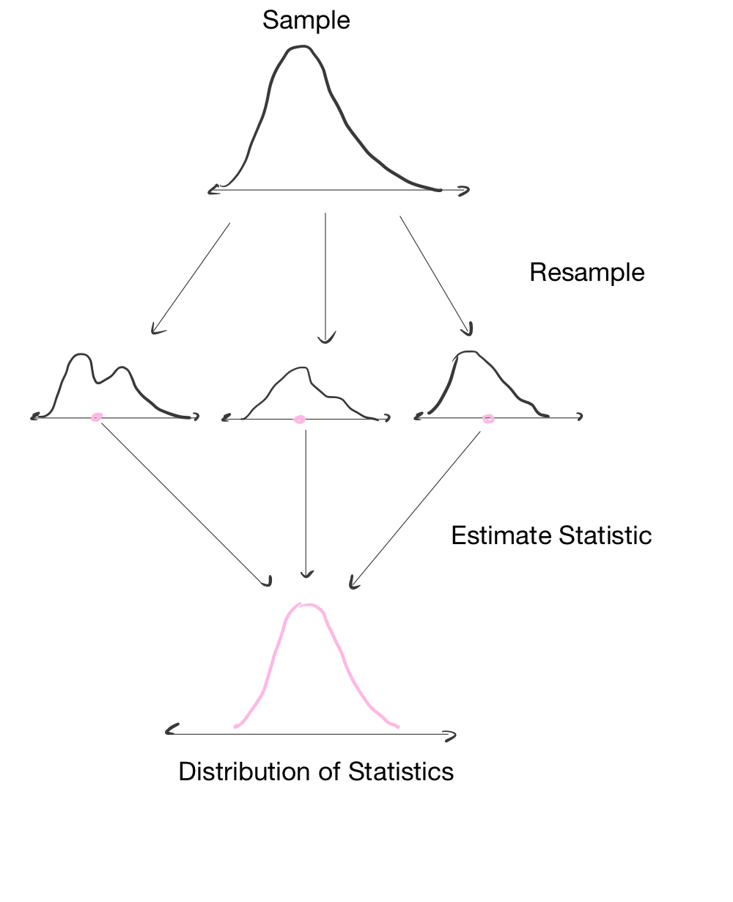

## Introduction to Bootstrapping

**Uncertainty Quantification**. The goal of bootstrapping is to quantify uncertainty in an estimate. A point estimate (such as a mean or proportion) is not enough on its own, because we also need to know how precise or variable that estimate is. For example, a batter with a 0.25 batting average is interpreted differently if the confidence interval is (0.20, 0.30) versus (0.10, 0.40). The narrower interval indicates greater precision and gives us more confidence in the estimate.

**Why do classical methods fail?** Classical (asymptotic) methods often depend on large samples and approximately normal sampling distributions, which may not hold in practice. With moderate sample sizes, skewed data, or complex estimators, standard error formulas and normal-based confidence intervals can be unreliable. 

**Why do we need it?** In real settings, we usually observe one sample, not the full population of all possible outcomes. In this lesson, we only have one season of Patriots plays. Bootstrapping gives us a way to estimate how much our result might vary from sample to sample.

### How Bootstrap Works
**Bootstrap Algorithm**:  

1. Start with observed dataset.  
2. Resample rows **with replacement** to create a new dataset of the same size.  
3. Recompute the statistic of interest.  
4. Repeat many times to build a bootstrap distribution.  
5. Use that distribution to form a confidence interval.

{width=75%}


## Preparing the Data

We begin by loading the data. The data was downloaded from [Pro Football Reference](https://www.pro-football-reference.com). Each week of data contains the offensive plays from the Patriots for the given week. We modified the data to remove turnovers, kneel-downs, penalties, and special team plays.

```{python}
import pandas as pd
import numpy as np

# Load in All Data
week1  = pd.read_csv("data/W1NEvsTexansWO.csv")
week2  = pd.read_csv("data/W2NEvsJagsWO.csv")
week3  = pd.read_csv("data/W3NEvsLionsWO.csv")
week4  = pd.read_csv("data/W4NEvsDolphinsWO.csv")
week5  = pd.read_csv("data/W5NEvsColtsWO.csv")
week6  = pd.read_csv("data/W6NEvsChiefsWO.csv")
week7  = pd.read_csv("data/W7NEvsBearsWO.csv")
week8  = pd.read_csv("data/W8NEvsBillsWO.csv")
week9  = pd.read_csv("data/W9NEvsPackersWO.csv")
week10 = pd.read_csv("data/W10NEvsTitansWO.csv")
week11 = pd.read_csv("data/W11NEvsJetsWO.csv")
week12 = pd.read_csv("data/W12NEvsVikingsWO.csv")
week13 = pd.read_csv("data/W13NEvsDolphinsWO.csv")
week14 = pd.read_csv("data/W14NEvsSteelersWO.csv")
week15 = pd.read_csv("data/W15NEvsBillsWO.csv")
week16 = pd.read_csv("data/W16NEvsJetsWO.csv")

# Combine Data into One Data Frame
plays = pd.concat(
  [
    week1, week2, week3, week4, week5, week6, week7, week8, 
    week9, week10, week11, week12, week13, week14, week15, week16
  ], ignore_index=True
)

print(plays.head())
```

## Plotting the Data
We plot the data to understand its distribution. In most plays, the Patriots gain yards. In some plays, they lose yards. Most often, they gain exactly zero yards.

```{python}
import matplotlib.pyplot as plt

# Plot Histogram
bins = np.arange(plays["Gained"].min(), plays["Gained"].max() + 2, 1)
plt.hist(plays["Gained"], bins=bins, edgecolor="black", density=True)
plt.title("Distribution of Yards Gained")
plt.xlabel("Yards Gained")
plt.ylabel("Density")
plt.show()
```

The key point is that the distribution is **not normal**. It is **asymmetric** because the Patriots are more likely to gain yards. It also has **heavy tails**, so some plays gain many yards.

Given these features, we should use the bootstrap to estimate the confidence interval.

---

## Calculating Bootstrapped Confidence Intervals
We begin by taking a sample (with replacement) from the original distribution using the `.sample(n, replace=True)` command:

```{python} 
n = len(plays["Gained"])
bins = np.arange(
  plays["Gained"].min(), 
  plays["Gained"].max() + 2, 1
)

# Plot: Compare Sample with Resample
resample = plays["Gained"].sample(n, replace=True)
  # resample original data
plt.hist(
  plays["Gained"], 
  bins=bins, edgecolor="black", density=True, 
  label="Original"
)
plt.hist(
  resample, 
  bins=bins, edgecolor="red", density=True, 
  label="Bootstrap Sample"
)
plt.title("Resampled Distribution of Yards Gained")
plt.xlabel("Yards Gained")
plt.ylabel("Density")
plt.legend()
plt.show()
```
The resampled distribution looks similar to the original distribution, but it's slightly different. We calculate a statistic from the resampled distribution: 

```{python}
orig_mean = plays["Gained"].mean().round(3)
resampled_mean = resample.mean().round(3)
print(f"Original Mean: {orig_mean}")
print(f"Resampled Mean: {resampled_mean}")
```

We find that the resampled mean is similar to the original mean. Now we repeat this process many times to get a bootstrapped confidence interval: 

```{python}

# Bootstrapped Confidence Interval
np.random.seed(123)
B = 1000 # number of bootstrapped replicates
n = len(plays["Gained"])
bootstrap_means = [
  (
    plays["Gained"]
      .sample(n, replace=True) # resample with replacement
      .mean()                  # get statistic 
  ) for _ in range(B)        # repeat many times
]

```

We visualize the bootstrapped distribution: 

```{python}
# Histogram of Bootstrapped Means
plt.hist(
  bootstrap_means, 
  edgecolor="black", density=True
)
plt.title("Bootstrapped Distribution of Sample Mean")
plt.xlabel("Yards Gained")
plt.ylabel("Density")
plt.show()
```

```{python}
# Get 95% Confidence Interval
ci_lo, ci_hi = np.percentile(bootstrap_means, [2.5, 97.5])
print(f"Bootstrap 95% CI: ({ci_lo:.3f}, {ci_hi:.3f})")
```

The 95% confidence interval is (5.558, 6.623), so we have a good idea that on average, the Patriots gain 5.5-6.6 yards per down. 


## Simulating 1st Down 

In this simulation, we model the process of gaining a first down by sampling from season data, allowing up to four downs to gain 10 yards.

::: {style="max-width: 420px; margin: 0 auto;"}
```{mermaid}
flowchart TD
    B{
      DOWN <= 4?
    }
    B -- No --> E([FIRST DOWN DENIED])
    B -- Yes --> C[RANDOMLY SAMPLE YARDS GAINED]
    C --> D{TOTAL YARDS GAINED >= 10?}
    D -- Yes --> F([FIRST DOWN!])
    D -- No --> G[NEXT DOWN]
    G --> B
```
:::

```{python}
np.random.seed(321)
down = 1
yards_to_go = 10
yards_gained = 0

while down <= 4 and yards_gained <= 10: 

  # Sample Yards Gained
  yards_gained += (            
      plays[plays["Down"] == down]  # filter by current down
      .sample()["Gained"]           # randomly select a play
      .iloc[0]                      # extract scalar value
  )
  print(f"Total Yards Gained: {yards_gained}")

  # Check if First Down Reached
  if yards_gained >= 10: 
    print("FIRST DOWN")
    break 
  else: 
    down += 1 
    print(f"Down: {down}")
```

At this point, it is helpful to wrap the simulation in a function. This keeps the code organized and easier to read.

```{python}
def simulate_possession(plays): 
  down = 1
  yards_gained = 0

  while down <= 4 and yards_gained <= 10: 

    # Sample Yards Gained
    yards_gained += (            
        plays[plays["Down"] == down]  # filter by current down
        .sample()["Gained"]           # randomly select a play
        .iloc[0]                      # extract scalar value
    )

    # Check if First Down Reached
    if yards_gained >= 10: 
      break 
    else: 
      down += 1 

  if yards_gained >= 10: 
    return True  # first down reached
  else: 
    return False # first down not reached
```

Now we wrap this in a `for` loop, so we can run many series. 

```{python}
np.random.seed(123)
num_sims = 100
prob_1stdown = [simulate_possession(plays) for i in range(num_sims)]
np.mean(prob_1stdown)
```

We find that there's a 82% chance the Patriots of reaching first down. We have no idea how reliable this number is, so we apply bootstrapping to figure it out. 

```{python}
# Wrap Probability Estimation in a Function
def est_prob_1stdown(plays, num_sims=100):
  prob_1stdown = [
    simulate_possession(plays) 
    for i in range(num_sims)
  ]
  return np.mean(prob_1stdown)

# Calculate Bootstrapped Confidence Interval
bootstrap_probs = [
  est_prob_1stdown(
    plays.sample(n=n, replace=True), 
    num_sims=100
  ) 
  for _ in range(100)        # repeat many times
]

# Get 95% Confidence Interval
ci_lo, ci_hi = np.percentile(bootstrap_probs, [2.5, 97.5])
print(f"Bootstrap 95% CI: ({ci_lo:.3f}, {ci_hi:.3f})")
```


```{python}
plt.hist(bootstrap_probs, bins=25, edgecolor="black")
plt.axvline(ci_lo, color="red", linestyle="--", label="2.5th percentile")
plt.axvline(ci_hi, color="red", linestyle="--", label="97.5th percentile")
plt.xlabel("Estimated first-down probability")
plt.ylabel("Count")
plt.title("Bootstrap Distribution of First-Down Probability")
plt.legend()
plt.show()
```

## In-Class Activities

1. Get the probability that yards gained is greater than 0. Get the corresponding bootstrap confidence interval.   
2. Get a confidence interval around the 90th percentile of yards gained (hint: use `quantile` function)   
3. Does the yards gained differ between downs? Get the bootstrapped confidence interval of each down to answer the question. 
4. Modify the code so we output the yards gained from the series instead of whether we gained first down or not.  
5. **Passing on first down**. What if we modified our simulation so that we only passed the ball on first down? Adjust the simulation to account for this modification. Give the probability of getting a first down when we pass on first down.  
6. **Running on first down**. What if we modified our simulation so that we only ran the ball on first down? Adjust the simulation to account for this modification. Give the approximate probability of getting a first down when we run on first down.  
7. **Adjusting 2nd and 3rd Down Based on Yards to Go**. Adjust the model to select only plays with (about) the same yards to go. For example, if it is 2nd down with 6 yards to go, randomly select a play (either running or passing) from the season that was 2nd down and between 5 and 7 yards to go. Do the same for 3rd down. Adjust the simulation to account for this modification. Give the approximate probability of getting a first down in at most three plays.  
8. **Average drive length**. Modify the simulation so that whenever a first down is achieved, the offense gets a new set of downs and the simulation continues. Use this to estimate the average drive length.  
